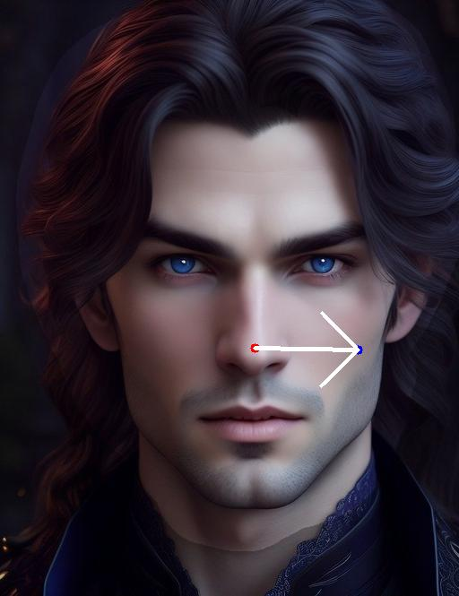
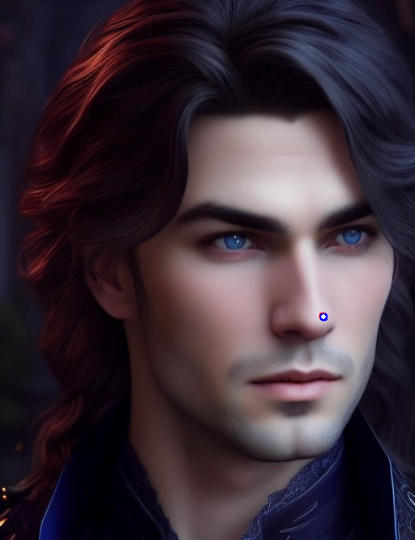
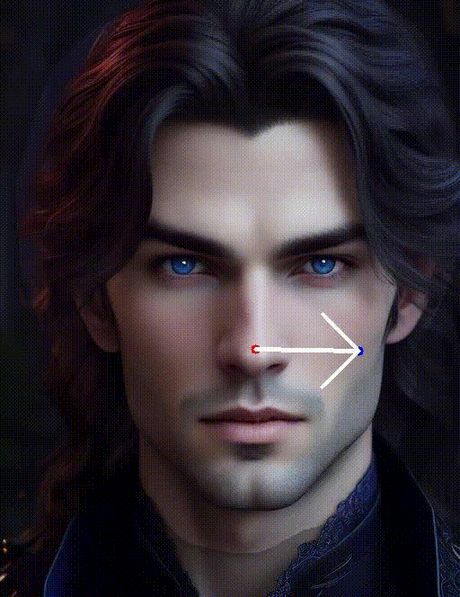
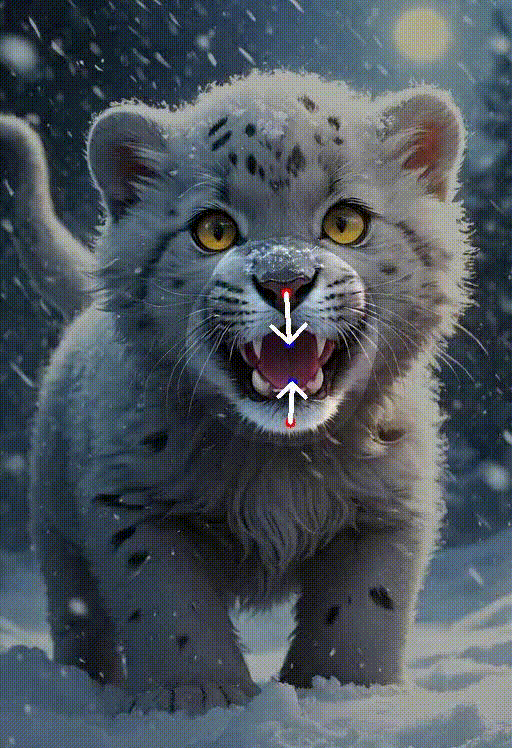
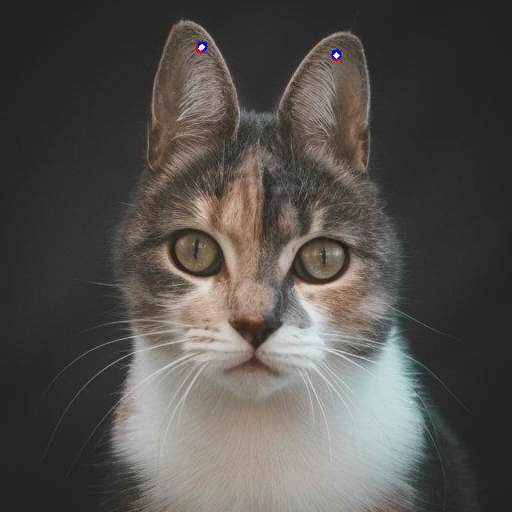
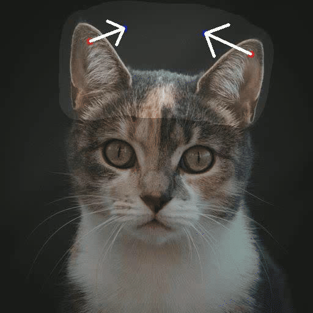
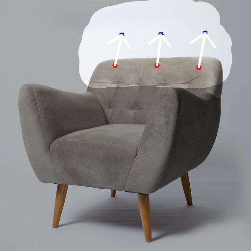
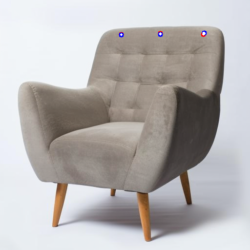

<p align="center">
  <h1 align="center"><em>GoodDrag</em>: Towards Good Practices for Drag Editing with Diffusion Models</h1>
  <p align="center">
    <strong>Zewei Zhang</strong>
    &nbsp;&nbsp;
    <strong>Huan Liu</strong>
    &nbsp;&nbsp;
    <a href="https://www.ece.mcmaster.ca/~junchen/"><strong>Jun Chen</strong></a>
	&nbsp;&nbsp;
    <a href="https://xuxy09.github.io/"><strong>Xiangyu Xu</strong></a>
  </p>


<div align="center">
    
    
    
    
</div>

<div align="center">
    
    
    
    
</div>

<div align="center">
    
    
    
    
</div>


<div align="center">
    
    
    
    
</div>


<div align="center">
    
    
    
    
</div>

<div align="center">
    
    
    
    
</div>

<div align="center">
    
</div>
<p align="center">
<br>
<a href='https://gooddrag.github.io/'></a>
<a href="https://arxiv.org/abs/2404.07206"></a>
<a href="https://colab.research.google.com/drive/1eoX-AngrcHocLKAgL5g5fyseLW_DusWl?usp=sharing"></a> 
<a href="https://drive.google.com/file/d/1qzUizzrSRd4bBaT-0bCYZr-MDpiKXjhW/view?usp=sharing"></a>
</p>

## 1. Getting Started with GoodDrag

Before getting started, please make sure your system is equipped with a CUDA-compatible GPU and Python 3.9 or higher. We provide three methods to directly run GoodDrag:
### 1️⃣ Automated Script for Effortless Setup

- **Windows Users:** Double-click **webui.bat** to automatically set up your environment and launch the GoodDrag web UI.
- **Linux Users:** Run **webui.sh** for a similar one-step setup and launch process.

### 2️⃣ Manual Installation via pip
1.  Install the necessary dependencies:
	
	```bash
	pip install -r requirements.txt
	```
2. Launch the GoodDrag web UI:

	```bash 
	python gooddrag_ui.py
	```

### 3️⃣ Quick Start with Colab
For a quick and easy start, access GoodDrag directly through Google Colab. Click the badge below to open a pre-configured notebook that will guide you through using GoodDrag in the Colab environment: <a href="https://colab.research.google.com/drive/1eoX-AngrcHocLKAgL5g5fyseLW_DusWl?usp=sharing"></a> 

### Runtime and Memory Requirements
GoodDrag's efficiency depends on the image size and editing complexity. For a 512x512 image on an A100 GPU: the LoRA phase requires ~17 seconds, and drag editing takes around 1 minute. GPU memory requirement is below 13GB.

## 2. Parameter Description

We have predefined a set of parameters in the GoodDrag WebUI. Here are a few that you might consider adjusting:
| Parameter Name | Description                                                  |
| -------------- | ------------------------------------------------------------ |
| Learning Rate  | Influences the speed of drag editing. Higher values lead to faster editing but may result in lower quality or instability. It is recommended to keep this value below 0.05. |
| Prompt         | The text prompt for the diffusion model. It is suggested to leave this empty. |
| End time step  | Specifies the length of the time step during the denoise phase of the diffusion model for drag editing. If good results are obtained early in the generated video, consider reducing this value. Conversely, if the drag editing is insufficient, increase it slightly. It is recommended to keep this value below 12. |
| Lambda         | Controls the consistency of the non-dragged regions with the original image. A higher value keeps the area outside the mask more in line with the original image. |

## 3. Acknowledgments
Part of the code was based on [DragDiffusion](https://github.com/Yujun-Shi/DragDiffusion) and [DragGAN](https://github.com/XingangPan/DragGAN). Thanks for the great work!

## 4. BibTeX
```
@article{zhang2024gooddrag,
    title={GoodDrag: Towards Good Practices for Drag Editing with Diffusion Models},
    author={Zhang, Zewei and Liu, Huan and Chen, Jun and Xu, Xiangyu},
    journal = {arXiv},
    year={2024}
}
```